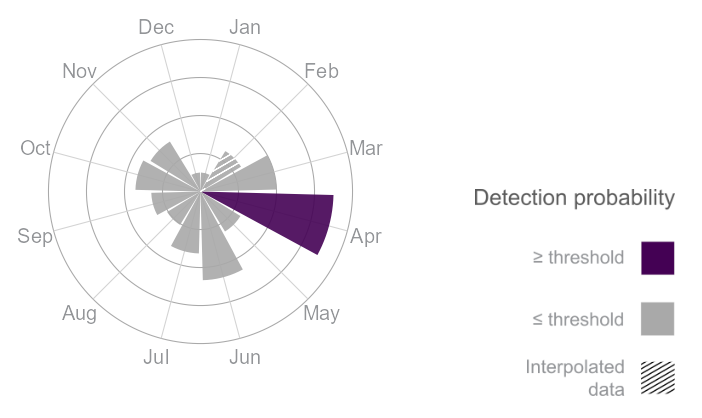
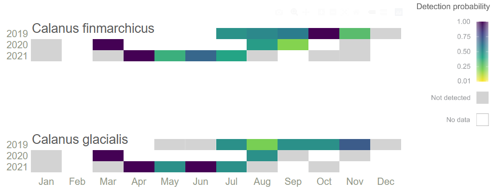
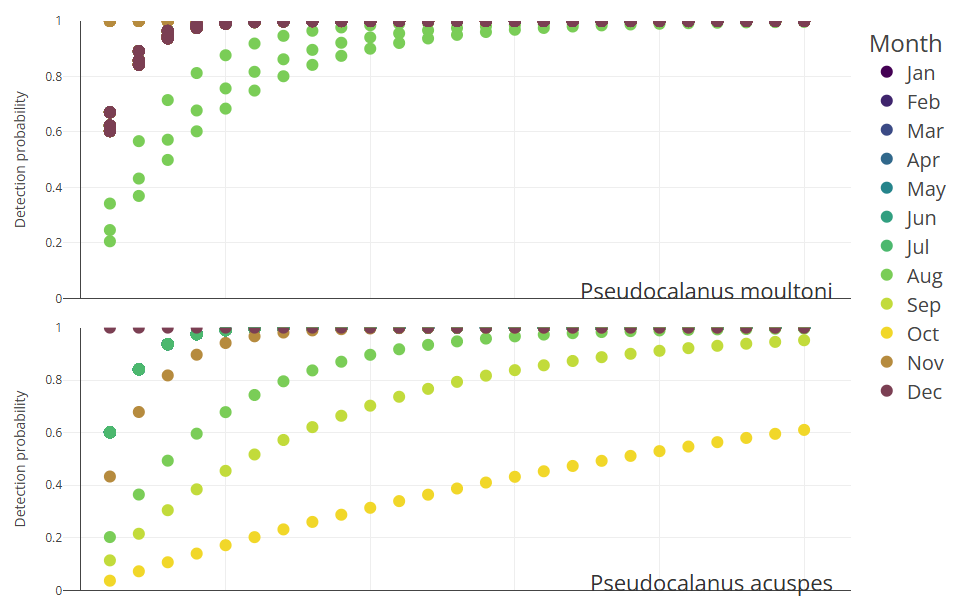
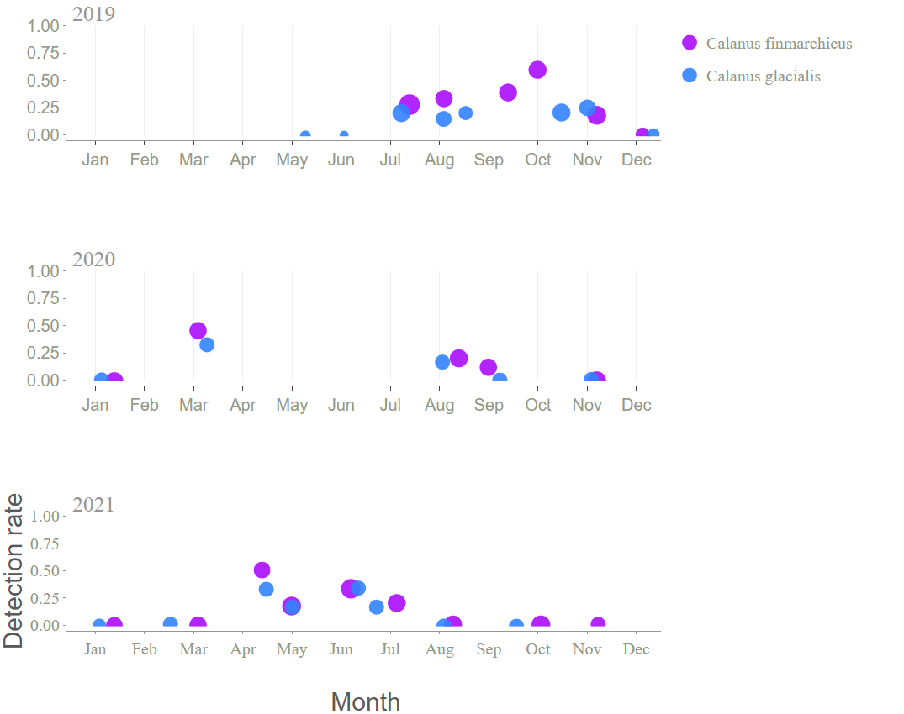

<!-- README.md is generated from README.Rmd. Please edit that file -->

# GOTeDNA

## An R package for guidance on optimal eDNA sampling periods to develop, optimize, and interpret monitoring programs

<!-- badges: start -->

<!-- badges: end -->

The goal of GOTeDNA is to import and format eDNA qPCR and metabarcoding metadata/data from GOTeDNA sample templates, visualize species detection periods, and statistically delineate optimal species detection windows.

## Installation

### For non-R users

#### Install R

We recommend to use R and RStudio: <https://posit.co/download/rstudio-desktop/>

1.  Download R for your OS: <https://cran.rstudio.com/>

2.  Install R Studio

### Install the GOTeDNA package

#### Install Rtools (For Windows)

Note: macOS and Linux do not need Rtools to be installed to run the GOTeDNA package

The Rtools version appropriate for your R Version will need to be installed from https://cran.r-project.org/bin/windows/Rtools/ 

To see what R Version you currently have:

  ``` r
R.version.string
```

#### R users with access to the GitHub repository

You can install the development version of GOTeDNA from [GitHub](https://github.com/) with:

``` r
install.packages("devtools")
devtools::install_github("AnaisLacoursiereRoussel/GOTeDNA", dependencies = TRUE)
```

Or if you have a local copy of the repo:

``` r
install.packages("devtools")
devtools::install_local("path/to/the/repo", dependencies = TRUE)
```

#### R users with access to the archive 

If you have obtained the archive `GoteDNA_{version}.tar.gz`, you can install the package using:

``` r
install.packages("path/to/GOTeDNA_{version}.tar.gz")
```

## Usage

### Table of Contents:

-   Shiny
-   Import data
-   Visualizations

To load the package: 

``` r
library("GOTeDNA")
```

### Shiny

#### Note: When viewing the Shiny app on a laptop (not a monitor), set the % Zoom on your screen to 67% by holding the "ctrl" and "-" keys on the keyboard at the same time to avoid distortion of the Figures.

The Shiny application can be launched with:

``` r
run_gotedna_app()
```

### Import data

To import your data within GOTeDNA, it must be formatted within the GOTeDNA template Excel sheets prior to calling in the `read_data()` function.  

Please refer to Appendix 2 in the GOTeDNA manuscript to access the sample metadata, qPCR, and metabarcoding templates.

### Visualization

The GOTeDNA app displays the following visualizations for each selected taxon and set of parameters (e.g. detection threshold, primer, etc.) 

#### Species monthly detection


#### Monthly detection probabilities
######Predicted sample size required to reach targeted probability of detection given the month of sampling.


#### Heat map
######Heamap displaying variation of normalized speces eDNA detection probability.


#### Effort needed



#### Sampling effort
######Monthly water sampling effort and proportion of samples having positive eDNA detection.


