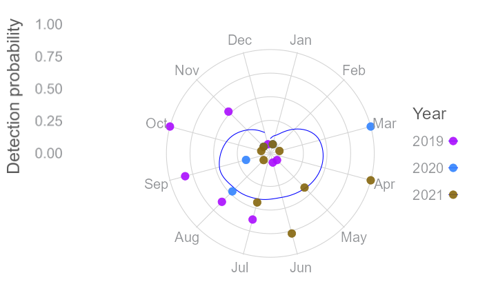
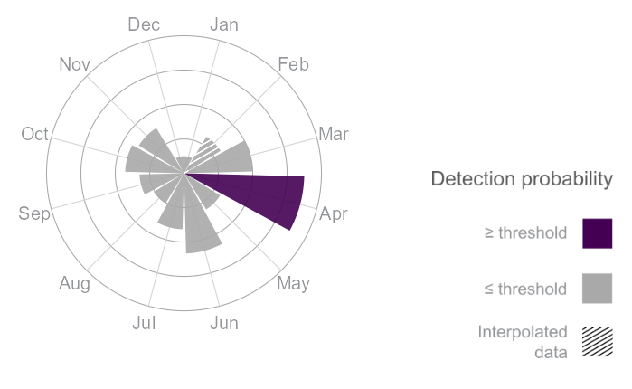
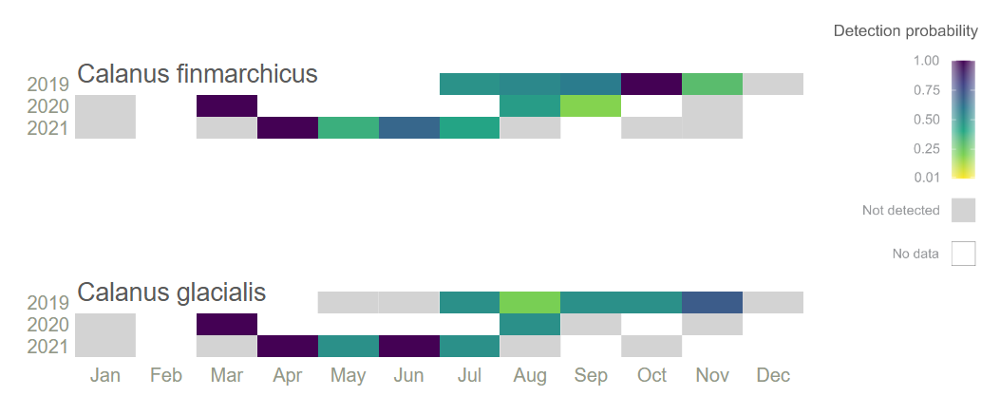
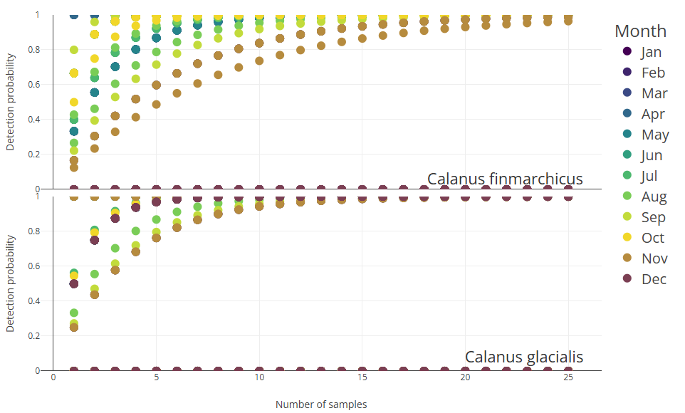
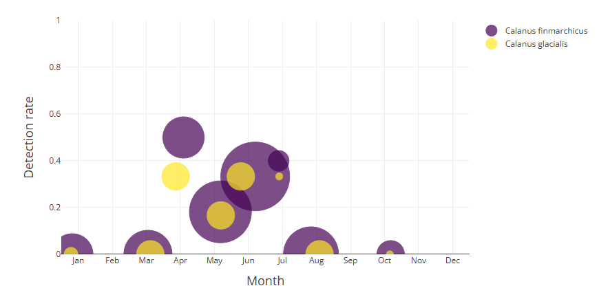

<!-- README.md is generated from README.Rmd. Please edit that file -->

# GOTeDNA

## An R package for guidance on optimal eDNA sampling periods to develop, optimize, and interpret monitoring programs

### This README is intended for installation and usage of the app. There is also a starter guide to the codebase provided [here](README_for_coders.md) in README_for_coders.md
<!-- badges: start -->

<!-- badges: end -->

The goal of GOTeDNA is to import and format eDNA metabarcoding metadata/data from GOTeDNA sample templates, visualize species detection periods, and statistically delineate optimal species detection windows.

## Installation

### Install R

Installation of R and RStudio are currently required to access the app.

This link will guide installation of both applications based on your operating system (Linux, Mac, Windows): <https://posit.co/download/rstudio-desktop/>

### Install the GOTeDNA Application

#### Hint (for Windows)

The Rtools version appropriate for your R Version will need to be installed. 

To see what R version you currently have, paste the following code into the R Console:

``` r
R.version.string
```
Then follow the instructions from https://cran.r-project.org/bin/windows/Rtools/ 

#### For installation
Install required packages by pasting the following code into the R Console:

``` r
install.packages(
  "leaflet.extras",
  repos = c(
    "https://trafficonese.r-universe.dev",
    "https://cloud.r-project.org"
  )
)

install.packages("pak")
pak::pak("AnaisLacoursiereRoussel/GOTeDNA")  
```

To load the GOTeDNA library and launch the Shiny application in a browser window: 

``` r
library(GOTeDNA)
run_gotedna_app()
```

### Import data (Optional)

To import your data within GOTeDNA, it must be formatted within the GOTeDNA template Excel sheets.  

Please refer to Appendices 1 and 2 in the GOTeDNA manuscript to access the sample metadata and metabarcoding templates.

### Visualization

The GOTeDNA app displays the following visualizations for each selected taxon and set of parameters (e.g. detection threshold, primer, etc.) 

#### Species monthly detection



#### Monthly detection probabilities
###### Predicted sample size required to reach targeted probability of detection given the month of sampling.


#### Heat map
###### Heatmap displaying variation of normalized species eDNA detection probability.


#### Effort needed



#### Sampling effort
###### Monthly water sampling effort and proportion of samples having positive eDNA detection.


