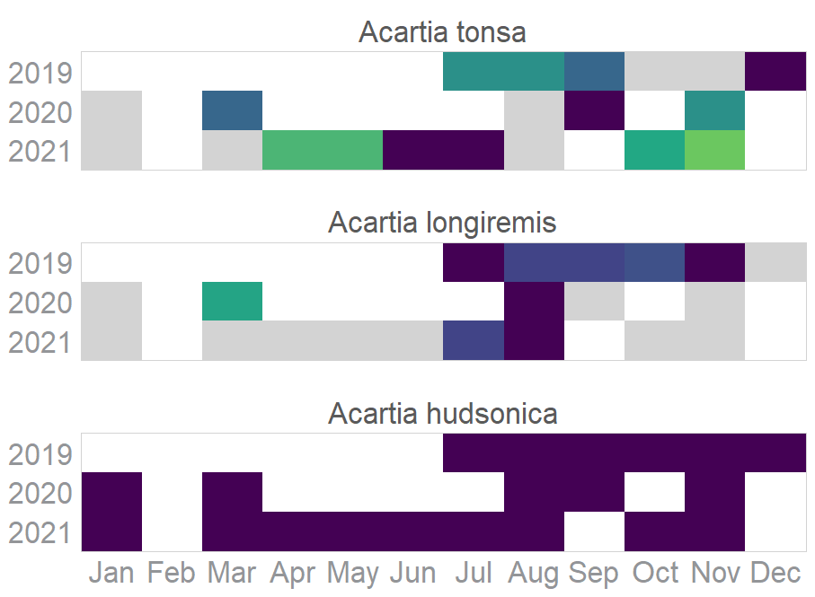
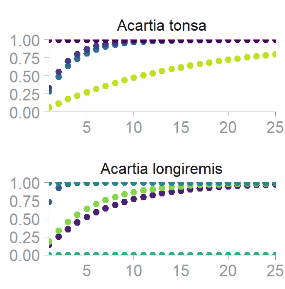
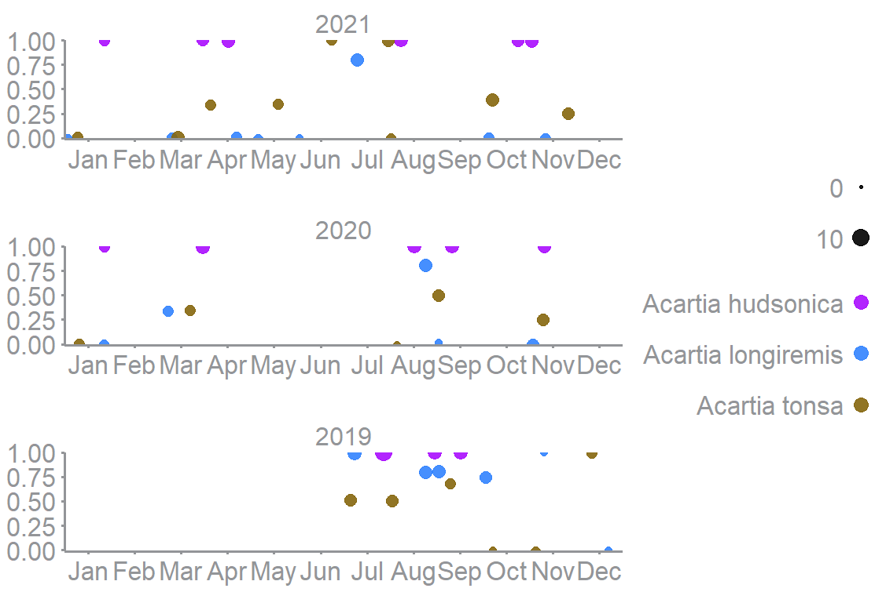

<!-- README.md is generated from README.Rmd. Please edit that file -->

# GOTeDNA

## An R package for guidance on optimal eDNA sampling periods to develop, optimize, and interpret monitoring programs

<!-- badges: start -->

<!-- badges: end -->

The goal of GOTeDNA is to import and format eDNA qPCR and metabarcoding metadata/data from GOTeDNA sample templates, visualize species detection periods, and statistically delineate optimal species detection windows.

## Installation

### For non-R users

#### Install R

We recommend to use R and RStudio: <https://posit.co/download/rstudio-desktop/>

1.  Download R for your OS: <https://cran.rstudio.com/>

2.  Install R Studio

### Install the GOTeDNA package

#### Install Rtools (For Windows)

Note: macOS and Linux do not need Rtools to be installed to run the GOTeDNA package

The Rtools version appropriate for your R Version will need to be installed from https://cran.r-project.org/bin/windows/Rtools/ 

To see what R Version you currently have:

  ``` r
R.version.string
```

#### R users with access to the GitHub repository

You can install the development version of GOTeDNA from [GitHub](https://github.com/) with:

``` r
install.packages("devtools")
devtools::install_github("AnaisLacoursiereRoussel/GOTeDNA", dependencies = TRUE)
```

Or if you have a local copy of the repo:

``` r
install.packages("devtools")
devtools::install_local("path/to/the/repo", dependencies = TRUE)
```

#### R users with access to the archive 

If you have obtained the archive `GoteDNA_{version}.tar.gz`, you can install the package using:

``` r
install.packages("path/to/GOTeDNA_{version}.tar.gz")
```

## Usage

### R function categories:

-   Shiny
-   Import data
-   Clean/tidy data
-   Visualization

To load the package: 

``` r
library("GOTeDNA")
```

### Shiny

#### Note: When viewing the Shiny app on a laptop (not a monitor), set the % Zoom on your screen to 67% by holding the "ctrl" and "-" keys on the keyboard at the same time to avoid distortion of the Figures.

The Shiny application can be launched with:

``` r
run_gotedna_app()
```

### Import data

To import your data within GOTeDNA, it must be formatted within the GOTeDNA template Excel sheets prior to calling in the `read_data()` function.

Please contact [Anais.Lacoursiere\@dfo-mpo.gc.ca](mailto:Anais.Lacoursiere@dfo-mpo.gc.ca) for access to the latest templates.

```         
D_mb_ex <- read_data(choose.method = "metabarcoding", path.folder = NULL)
```

### Clean/tidy data

As the Shiny app controls the filtering of each function internally, please filter to the taxonomy level and name that you wish to explore with `dplyr::filter()` when working with the code outside the app.

The example data herein contains a sample of metabarcoding data from a single protocol, and contains only the species detected within genus *Acartia*.

``` r
newprob <- calc_det_prob(
  data = D_mb_ex |> dplyr::filter(genus == "Acartia")
  )

scaledprobs <- scale_newprob(
  data = D_mb_ex |> dplyr::filter(genus == "Acartia"), 
  newprob
  )

win <- calc_window(
  threshold = "75",
  scaledprobs = scaledprobs |> dplyr::filter(species == "Acartia longiremis")
  )

win$opt_sampling
win$fshTest
```

### Visualization

#### Species monthly detection

``` r
 smooth_fig(
   data = D_mb_ex |> dplyr::filter(species == "Acartia longiremis")
   )
```


#### Monthly detection probabilities

``` r
thresh_fig(
  threshold = "75",   
  scaledprobs = scaledprobs |> dplyr::filter(species == "Acartia longiremis")
)
```


#### Heat map

``` r
hm_fig(
  scaledprobs = scaledprobs |> dplyr::filter(class == "Copepoda")
)
```



#### Effort needed

``` r
effort_needed_fig(
   scaledprobs = scaledprobs |> dplyr::filter(species == c("Acartia longiremis","Acartia tonsa"))
)
```



#### Sampling effort

``` r
field_sample_fig(
  data = D_mb_ex |> dplyr::filter(class == "Copepoda")
)
```


