# Starter Guide to the GOTeDNA Codebase

# Introduction

This document is intended for coders or reviewers who wish to better understand the GOTeDNA code. The structure of this document follows the data flow chart below which shows how data flow through the app. Red numbers on the flow chart correspond to section numbers of this document. There is also a screenshot at each section showing the visual part of the app that corresponds with that section.  
**Quicktip:** function and Shiny ID names have been provided in **bold** so that a programmer in rStudio can run a global search (ctrl \+ shift \+ f) for that text. Filenames can also be searched and opened in rStudio with ctrl \+ . (ctrl key combined with period key)

# Visual Table of Contents

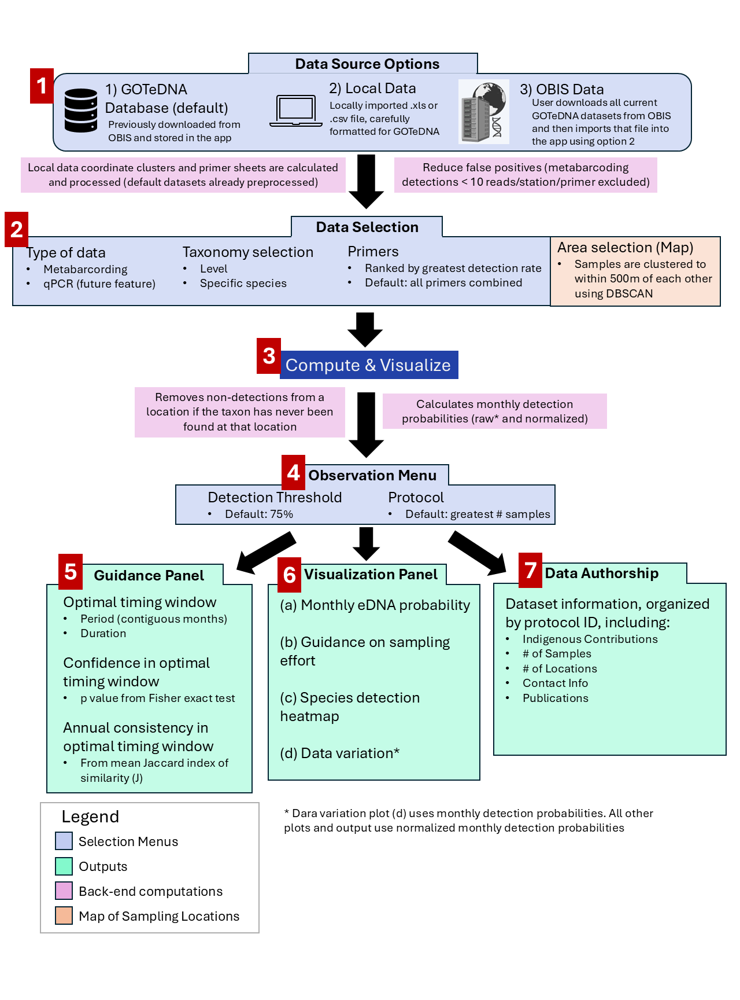

# 1\. Data Source Options

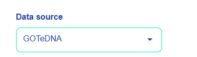

This menu is defined in **mod\_select\_data.R**.with the id, “datasource”. The menu state and dynamic toggling of the “Browse” and “Download” buttons are also handled here.

## GOTeDNA Database (default)

* The default data, previously pulled from OBIS, is loaded in **global.R** from the file “data/gotedna\_data.rds". This datafile was previously prepared using the code in the **prepare\_data.R** file.  
* Preprocessed primer sheets and station data are also loaded from “data/gotedna\_primer.rds” and “data/gotedna\_station.rds”. This is to help speed up and simplify menu and map interactions.  
* These data are always present as objects in the app and are reassigned to the current data, **r$cur\_data**, using this “datasource” menu. Station and primer sheets are also reassigned here.

## Local Data

* A user can import their own, carefully formatted, data into the app using the Data Source menu. A “Browse” button appears for the user to import the data. This button is defined in **mod\_select\_data.R** with the id “external\_files”.  
* The observer function for this button generates the necessary location data (using DBSCAN clustering) and primer sheets and reassigns the necessary variables.  

## Download OBIS Data

* A user can download a fresh GOTeDNA data file from OBIS using this option, defined in **mod\_select\_data.R** with id “download\_button”. Once confirmed, the download uses the function **big\_OBIS\_data\_pull()** defined in **global.R** to download and properly format the data for GOTeDNA. **big\_OBIS\_data\_pull()** in turn uses the **read\_data()** function defined in **read\_data.R** to filter and download the correct datasets from OBIS.  
* Location clusters (called stations in the code) are calculated using the **update\_station\_variable()** function defined in **read\_data.R**.  
* Primer info for the imported data is calculated directly in the “external\_file” observer in **mod\_select\_data.R**.

# 2\. Data Selection

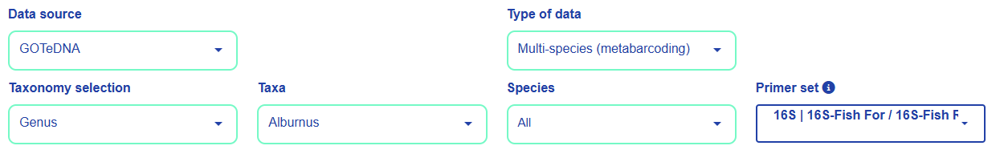

## Type of data

This menu is defined in **mod\_select\_data.R** with id “data\_type”. It currently only has the option of metabarcoding but the code is partially set up to handle the option of qPCR data. This is intended as a future feature of the app.

## Taxonomy selection

The three menus for taxonomy selection or defined in **mod\_select\_data.R** with ids “taxo\_lvl”, “taxo\_id”, and “slc\_spe”. The function of these menus are tightly linked and mostly handled in the observeEvent function for “taxo\_id”. Their selections are used later in the pipeline to filter the data.

## Primer set 

The primer menu is defined in **mod\_select\_data.R** with id “primer”. Primer options are filtered according to the taxa selections and subsequent primer selection is stored in the reactive variable **r$primer**.

## Area selection

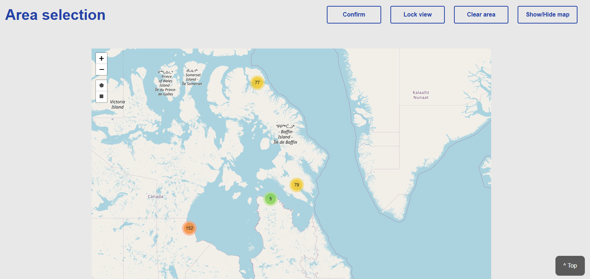

* Map is initialized with the **basemap()** function defined in **global.R**. Map behaviour is handled in **mod\_select\_data.R** by the observeEvent functions for “listenMapData()” and “input$confirm”.  
* The clustering function for defining map locations is defined in **read\_data.R** and is run when a data file is imported into the app. (See section 1 above)

# 3\. Compute & Visualize

When a user clicks “Compute & Visualize” a large observeEvent function for **input$compute\_and\_visualize** is run in **mod\_select\_figure.R**. This function filters data, calculates detection probabilities and prepares the output for the Observation Menu (see section 4 below).

* If genus level is selected along with “All” species, detection probabilities are calculated for all individual species in that genus (for comparison in figures) as well as for the entire genus as one taxon. If a broader taxon level is selected along with “All” species, only summarized taxon detection probabilities are calculated.  
* **calc\_det\_prob()** is defined in **calc\_det\_prob.R** and returns the monthly detection probabilities for specified taxa organized both by year and for years pooled together.  
* **scale\_newprob()** is defined in **scale\_newprob.R** and calculates normalized detection probabilities. It also fills in missing months with interpolated average values.  
* **calc\_window()** is defined in **calc\_window.R.** It calculates the optimal detection window of months based on the detection threshold provided. It also includes a Fisher’s exact test to measure the confidence in the optimal detection window (difference in detection between optimal months and non-optimal months).  
  * **calc\_window.R** also includes **drop\_all\_zero\_taxa()** which drops any taxon from a given location if the taxon has never been found at that location with the selected protocol\_ID.  
* **jaccard\_test()** is defined in **jaccard\_test.R** and calculates how consistent the optimal detection window is among years.

# 4\. Observation Menu (and Explore Protocols)

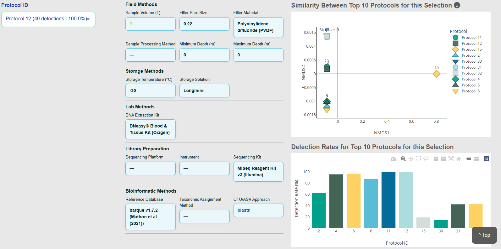
The "Explore Protocols" section is defined in **mod\_select\_figure.R** with id "protocol_details". The nmds and bar plot have ids **protocol\_nmds\_plot** and **protocol\_bargraph** live in **R/nmds\_plot.R** and **R/protocol\_bargraph.R**. The 

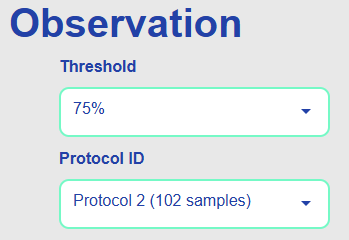  
The observation menus are defined in **mod\_select\_figure.R** with ids “threshold” and “prot\_id”. When these selections change, Compute and Visualize (see section 3 above) is rerun.

## Threshold

* threshold menu options are defined in **global.R** as **ls\_threshold.** The selected threshold, input$threshold, is used in “compute\_and\_visualize” (see section 3 above) to calculate detection probabilities.

## Protocol ID

* protocol ID menu is updated with **update\_protocol\_menu()** defined in **mod\_select\_figure.R**. The selected protocol ID, input$prot\_id is used in “compute\_and\_visualize” (see section 3 above) to filter data.

# 5\. Guidance Panel

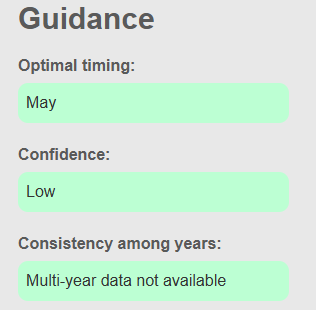

The guidance panel is defined in **mod\_select\_figure.R** with ids “opt\_sampl”, “conf”, and “var\_year”.

* Optimal timing (“opt\_sampl”) displays results from the **calc\_window()** function (see section 3 above)  
* Confidence (“conf”) displays results from the **calc\_window()** function (see section 3 above)  
* Consistency among years (“var\_year”) displays results from the **jaccard\_test()** function (see section 3 above)

# 6\. Visualization Panel

## Monthly eDNA Detection Probability

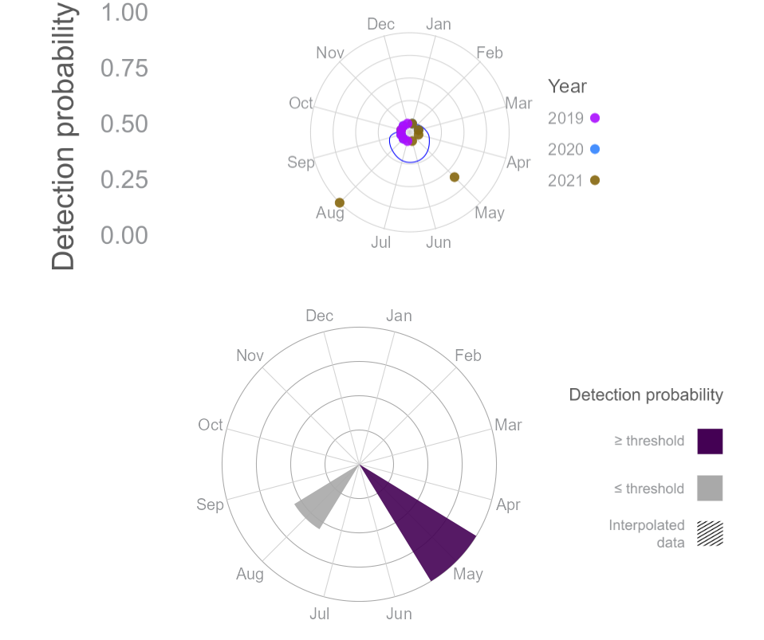

* these two visualizations are set up in **mod\_select\_figure.R** with ids “fig\_detect” and “fig\_smooth”  
* fig\_smooth corresponds to the upper figure and is defined in **R/smooth\_fig.R**  
* fig\_detect corresponds to the lower figure and is defined in **R/thresh\_fig.R**

## Guidance on Sampling Effort

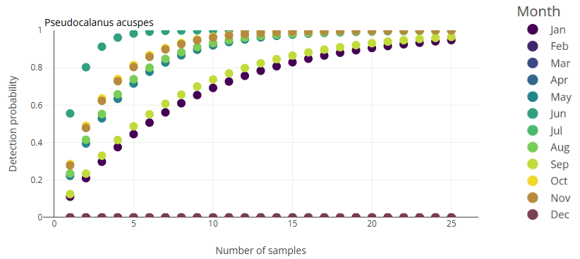

* set up in **mod\_select\_figure.R** with id “fig\_effort”. The plot is defined in **R/effort\_needed\_fig.R**

## Species detection Heatmap

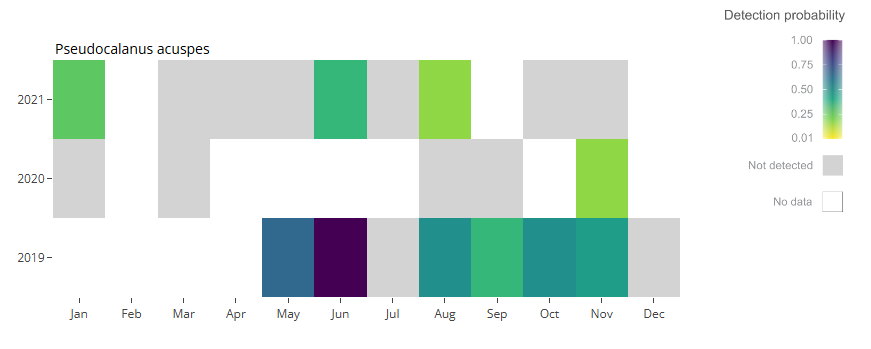

* set up in **mod\_select\_figure.R** with id “fig\_heatmap”. The plot is defined in **R/hm\_fig.R**

## Data variation

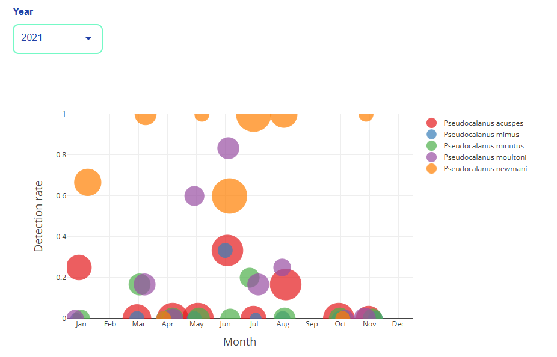

* set up in **mod\_select\_figure.R** with id “fig\_samples”. The plot is defined in **R/field\_sample\_fig.R**

# 7\. Data Authorship

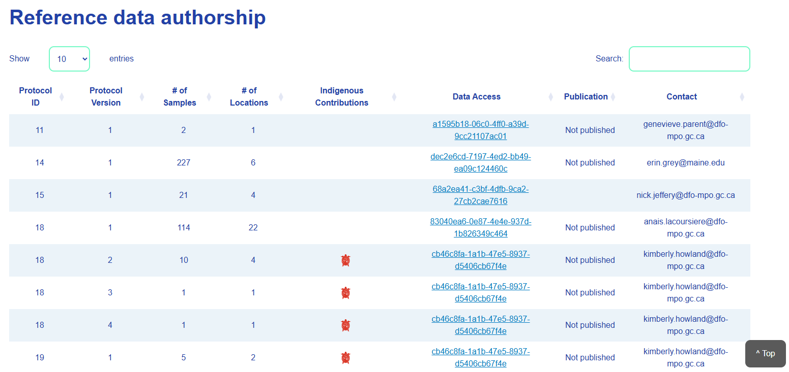

* the data authorship table is defined in **mod\_select\_figure.R** with id “data\_authorship”. The function that builds the table, including Indigenous contribution buttons and modals, is **output$data\_authorship**.
